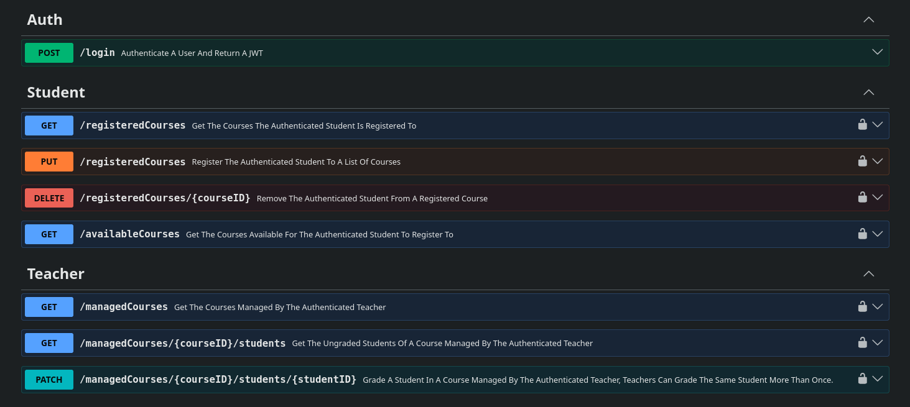
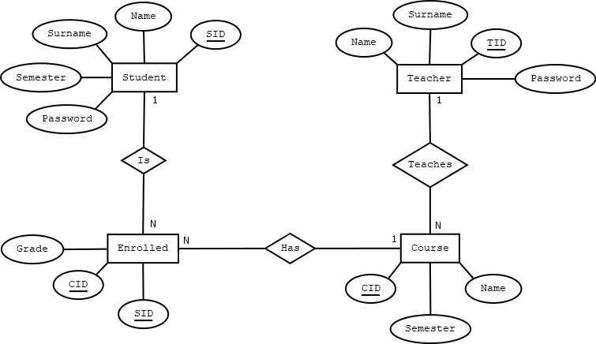

# UniSys

A REST API backend for a university management system, built with Express and MySQL. It supports three roles — Student, Teacher, and Secretary — each with their own set of permissions, and ships with interactive Swagger documentation.

## Live Demo

Try the API directly via Swagger at **[unisys.250724.xyz/docs](https://unisys.250724.xyz/docs)** 

 

Only Teacher and Student demo accounts are provided in the login dropdown (Secretary access won't be exposed publicly).

## Features

- JWT authentication with role-based access control across three permission levels
- Course registration and grading workflows, with authorization enforced per-resource
- Secretary-level CRUD over students, teachers, and courses, plus semester advancement
- Interactive API docs via Swagger UI

## Tech Stack

- Node.js / Express
- MySQL
- JWT for for statelessness with role-based access control (roles are encoded inside the token)
- `bcrypt` for password hashing
- `joi` for request validation
- `swagger-jsdoc` + `swagger-ui-express` for API documentation
- Docker / Docker Compose for quick and containerized build


## ER Model



The system has a single Secretary account that seeds its credentials from the environment file, and since that account is the moderator of the system it cannot be created, edited or deleted.

## Run It Yourself!

### Prerequisites

- Docker

### Setup

1. Clone the repository.
2. Rename `backend/.envexample` to `backend/.env`
3. From the `backend` directory, start the stack:

   ```bash
   docker compose up --build
   ```

   This starts up the API server and a MySQL database, seeded  from `db/init.sql` . 

4. The API will be available at `http://localhost:<PORT>`.

### API Documentation

Once the server is running, Swagger UI is available at:

```
http://localhost:<PORT>/docs
```

To try authenticated routes: log in via `POST /login` with the provided demo accounts or use the credentials mentioned in the .env file for the secretary, copy the returned `token`, then click **Authorize** in the Swagger UI and paste it in.


## Frontend

A React + TypeScript frontend is in progress on the [`frontend`](../../tree/frontend) branch (not yet merged to `master`). Auth (login, protected routes) is wired up against the API.

### Stack 
- React
- TypeScript 
- Vite 
- Tailwind CSS

### Run It Yourself!
```bash
cd frontend
npm install
npm run dev
```

Set the VITE_API_BASE_URL environment variable to a url of a running instance of the API, and make sure the backend's `CORS_ORIGIN` env var includes the frontend's url and port.

## License

ISC
